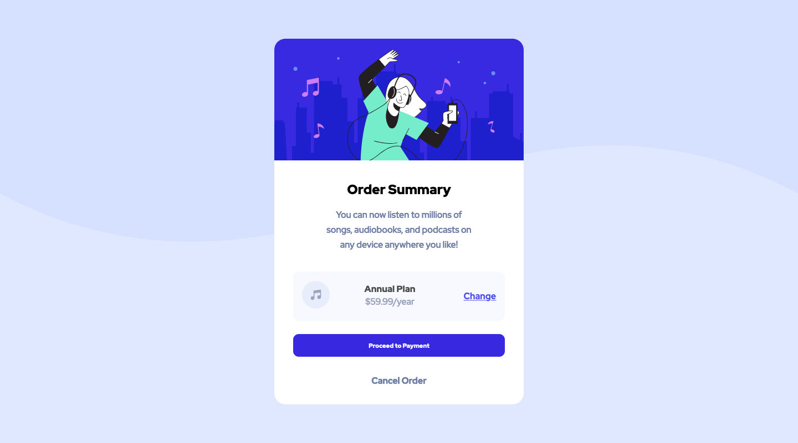

# Frontend Mentor - Order Summary Card Solution

This is my solution to the [Order Summary Card Challenge on Frontend Mentor](https://www.frontendmentor.io/challenges/order-summary-component-QlPmajDUj).

## Table of contents

- [Overview](#overview)
  - [The challenge](#the-challenge)
  - [Screenshot](#screenshot)
  - [Links](#links)
- [My process](#my-process)
  - [Built with](#built-with)
- [Author](#author)

## Overview

### The challenge

Users should be able to:

- See hover states for interactive elements

### Screenshot

### Links

- Solution URL: [Add solution URL here](https://www.frontendmentor.io/solutions/mobile-first-responsive-design-using-flexbox-K0rExOQ7R)
- Live Site URL: [Add live site URL here](https://joepdoyle.github.io/front-end-mentor-order-summary-component/)

## My process

### Built with

- Semantic HTML5 markup
- CSS custom properties
- Flexbox
- Mobile-first workflow

## Author

- Frontend Mentor - [@joepdoyle](https://www.frontendmentor.io/profile/joepdoyle)
- Twitter - [@joepdoyle\_](https://www.twitter.com/joepdoyle_)
